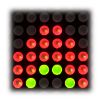
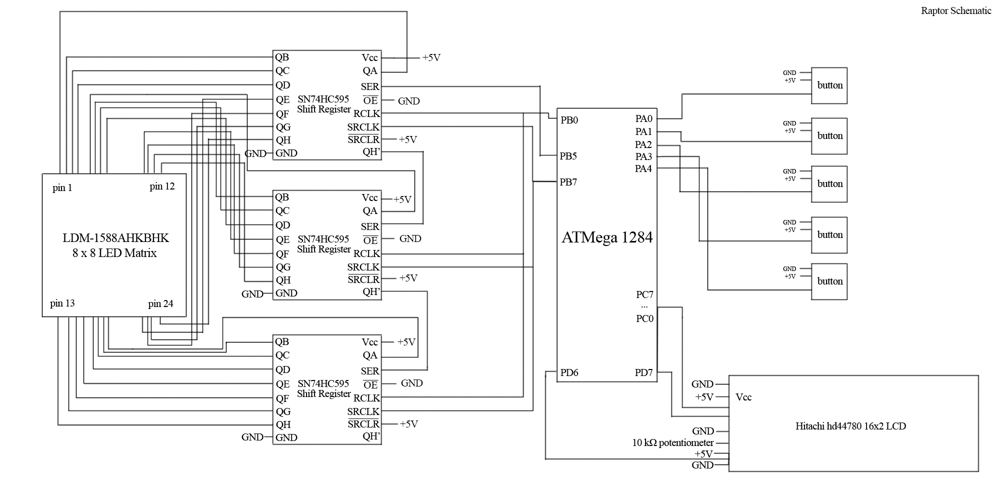

# Raptor! Embedded Systems - Ed.

A homage to Raptor: Call of the Shadows, originally released on MS-DOS.

Demonstration: <a href="https://youtu.be/adyEfLRWdGE" target="_blank">UCR EE/CS 120B Spring 2015 -- Michael Chen -- Raptor</a>

##User Manual##

**Button orientation**

* rightmost button: 0
* second from the right button: 1
* second from the left button: 2
* leftmost button: 3
* button at the top right: 4

**Main menu**

* Play
	* 0: right
	* 1: left
	* 2: up
	* 3: down

* Select difficulty
	* 0: Easy
	* 1: Medium
	* 2: Hard
	* 3: God Tier

* Easter egg
	* Press me!

##Technologies and components used##

* ATMega 1284 microcontroller
* Hitachi hd44780 16x2 LCD display
* SN74HC595 shift registers
* LDM-1588AHKBHK 8 x 8 LED matrix
* OLIMEX device
* AVR Studio 6.2

